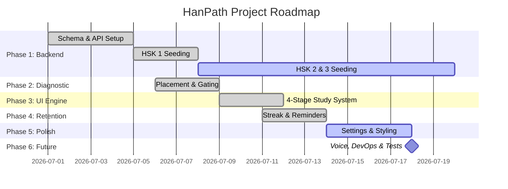

# HanPath Implementation Progress Tracker

This document tracks the tasks and milestones for **HanPath**, a structured daily Chinese learning application.

## Overall Implementation Summary

- **Total Tasks**: 24 (excluding Maintenance & Bug Fixes)
- **Completed Tasks**: 16
- **In-Progress Tasks**: 0
- **Not Started Tasks**: 8
- **Overall Project Completion**: **~67%** (Core Web App: **~95%**)

---

## Detailed Task Board

| Task / Feature Description | Phase | Checklist Status | Progress (%) | Notes |
| :--- | :--- | :---: | :---: | :--- |
| **SQLite Database Schema & Setup** | Phase 1: Database & Backend | `Complete` | 100% | Configured in `database.js` with schemas for lessons, vocab, grammar, dialogues, and progress tracking. |
| **Express API & Server Routes** | Phase 1: Database & Backend | `Complete` | 100% | Implemented in `server.js` with routes for lessons, full curricula, and user progress backup. |
| **Full HSK 1 Curriculum Seeding** | Phase 1: Database & Backend | `Complete` | 100% | Remapped to official 300 words A-Z standard; all 26 dynamic thematic lessons generated and seeded. |
| **HSK 2 & 3 Curriculum Seeding** | Phase 1: Database & Backend | `Not Started` | 0% | Remapped to official sizes (200 words for HSK 2, 500 for HSK 3); theme mapping completed; HSK 2 Day 1 generated. |
| **HSK 4, 5, 6 Curriculum Seeding** | Phase 1: Database & Backend | `Not Started` | 0% | Advanced content generation and database seeding for higher proficiency levels. |
| **Level Placement Pre-Test System** | Phase 2: Diagnostic & Assessment | `Complete` | 100% | 12-question diagnostic test that maps results to recommended start levels. |
| **Lesson Pre-test (Gating)** | Phase 2: Diagnostic & Assessment | `Complete` | 100% | 3-question diagnostic pre-test for each lesson with an option to skip if scored 100%. |
| **Stage 1: Vocabulary & Tracing** | Phase 3: Core Learning Engine | `Complete` | 100% | Flashcards with click-to-flip animations and an interactive drawing canvas using `hanzi-writer.min.js`. |
| **Stage 2: Grammar & Practice** | Phase 3: Core Learning Engine | `Complete` | 100% | Grammar explanations, example sentences, and interactive word-reordering exercises. |
| **Stage 3: Dialogue & TTS Playback** | Phase 3: Core Learning Engine | `Complete` | 100% | Bilingual dialogue reader with speaker avatars, translation toggle, and speech synthesis engine. |
| **Stage 4: Lesson Review Quiz** | Phase 3: Core Learning Engine | `Complete` | 100% | Dynamic 15-question quiz mimicking official HSK 3.0 formats (True/False, Listening, Reading). |
| **Pinyin Chart (Lesson 0)** | Phase 3: Core Learning Engine | `Complete` | 100% | Interactive CSS grid with hover popups and 1,600+ human-recorded MP3s mapped dynamically from Purple Culture. Replaces computer 'v' with proper 'ü'. |
| **Streak & Time-Spent Tracking** | Phase 4: Consistency & Retention | `Complete` | 100% | Tracks study streak and total hours; streaks reset dynamically if a day is skipped. |
| **Daily Study Reminder System** | Phase 4: Consistency & Retention | `Complete` | 100% | Periodic interval checks on user-set reminder times and integrated UI status notifications. |
| **User Progress Synchronization** | Phase 4: Consistency & Retention | `Complete` | 100% | Multi-storage model syncing local state (`localStorage`), Express SQLite backend, and IDE `student_progress.json` file. |
| **Settings & Account Management** | Phase 5: Settings & UX Polishing | `Complete` | 100% | Dropdown selectors to change HSK level and database-wide user progress reset button. |
| **Kid-friendly styling & animations** | Phase 5: Settings & UX Polishing | `Complete` | 100% | Tailored kid-friendly theme with smooth bouncy spring-like physics and transitions; mobile layout refined. |
| **Thai Localization Expansion** | Phase 5: Settings & UX Polishing | `Complete` | 100% | Integrated a structural language-selection modal with full Turso DB translations for Thai (Vocab, Grammar, Dialogues). |
| **Pronunciation Assessment** | Phase 6: Future Enhancements | `Not Started` | 0% | Planned integration of speech recognition API to analyze and score user speech input. |
| **Multi-Character Writing Pad** | Phase 6: Future Enhancements | `Not Started` | 0% | Expand `hanzi-writer` logic to allow drawing multiple characters sequentially for vocabularies longer than one character. |
| **Full HSK Mock Exams (2026 Format)** | Phase 6: Future Enhancements | `Not Started` | 0% | Add comprehensive end-of-level exams simulating the latest official HSK format. |
| **Contextual LLM Translation Pipeline** | Phase 6: Future Enhancements | `Not Started` | 0% | Build a free-tier LLM data generation script for future curriculum seeding to avoid literal word-by-word translations. |
| **Production Deployment & Custom Domains** | Phase 6: Future Enhancements | `Not Started` | 0% | Docker containerization, Vercel deployment, and setup of a clean, branded custom domain. |
| **Automated Test Suite** | Phase 6: Future Enhancements | `Not Started` | 0% | Mock backend API testing (Jest/Supertest) and frontend component testing. |
| **Authentication Stability Fix** | Maintenance & Bug Fixes | `Complete` | 100% | Resolved case-sensitivity login failures in `auth.js` and removed syntax errors in `app.js` blocking session loads. |
| **Pre-Test Data Injection** | Maintenance & Bug Fixes | `Complete` | 100% | Restored missing `preTestQuestions` array into `app.js` to unblock user progression to the dashboard. |
| **Backend N+1 Query & Architecture Refactor** | Maintenance & Bug Fixes | `Complete` | 100% | Resolved massive N+1 query loops in `/api/curriculum`, replaced sync IO with `fs.promises`, and added Turso resilience retries. |
| **Quiz & Localization Refactor** | Maintenance & Bug Fixes | `Complete` | 100% | Centralized `ld()` localization, forced dynamic 10+ question localized quizzes, fixed question skip bug, added 'Re-learn' button. |
| **Curriculum, Quiz & Thai Layout Fixes** | Maintenance & Bug Fixes | `Complete` | 100% | Patched CSV parsing to prevent "meaning" placeholder bug, added dynamic Day prefixes, translated 39 themes, and fixed Thai vertical tone clipping in quiz options. |
| **HSK 1 Official 300-Word & Semantic Theme Overhaul** | Maintenance & Bug Fixes | `Complete` | 100% | Replaced 500-word generator with official 300-word dataset, mapped 38 semantic themes (Greetings, Family, Food), added UI defensive quiz guards, and updated DB import mapping for Thai fields. |
| **Standardized Database Schema Refactor** | Maintenance & Bug Fixes | `Complete` | 100% | Migrated Turso tables to explicit suffix translation columns (`_en`/`_th`), dropped legacy quizzes table, and updated server endpoints. |
| **Frontend Localization & Crash Patch** | Maintenance & Bug Fixes | `Complete` | 100% | Fixed `window.CHINESE_LESSONS` signup crash and updated `translateUI` to update static page elements (headers, badges) on language toggle. |
| **Transactional Seeding Skip Optimization** | Maintenance & Bug Fixes | `Complete` | 100% | Implemented check-and-skip seeder validation, transaction rollback, and interactive CLI prompts to prevent redundant Turso writes. |
| **Quota-Aware HSK Curriculum Generator Optimizations** | Maintenance & Bug Fixes | `Complete` | 100% | Removed quiz logic, optimized token limits (~30% saving), added uncorrupting garbage-collection, and resume capability. |
| **HSK 3.0 (2026 Standard) Remapping & Dynamic Clustering Overhaul** | Maintenance & Bug Fixes | `Complete` | 100% | Remapped all 11,092 terms to 2026 standard levels; clustered dynamically (26 themes HSK 1, 19 themes HSK 2); resolved double day prefix bugs; cleaned delete_hsk1.js; seeded Day 1-8. |
----

## Phase-wise Breakdown

### Phase Progress Breakdown

1. **Phase 1: Database & Backend** (SQLite, REST API, Seeding)
   - **Progress**: 60%
   - *Next Action*: Generate and seed the remaining HSK 2 (19 days) and HSK 3 curriculum data.
2. **Phase 2: Diagnostic & Assessment** (Placement & Gating)
   - **Progress**: 100%
   - *Next Action*: Complete.
3. **Phase 3: Core Learning Engine** (Vocab, Grammar, Dialogue, Quiz)
   - **Progress**: 100%
   - *Next Action*: Complete.
4. **Phase 4: Consistency & Retention** (Streak, Time, Reminders, Sync)
   - **Progress**: 100%
   - *Next Action*: Complete.
5. **Phase 5: Settings & UX Polishing** (Settings, Reset, Spring Animations)
   - **Progress**: 100%
   - *Next Action*: Complete.
6. **Phase 6: Future Enhancements** (Voice Assessment, DevOps, Testing)
   - **Progress**: 0%
   - *Next Action*: Plan speech-to-text API integration and outline tests.
