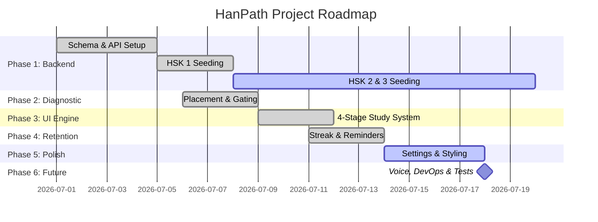

# HanPath Implementation Progress Tracker

This document tracks the tasks and milestones for **HanPath**, a structured daily Chinese learning application.

## Overall Implementation Summary

- **Total Tasks**: 27 (excluding Maintenance & Bug Fixes)
- **Completed Tasks**: 19
- **In-Progress Tasks**: 1
- **Not Started Tasks**: 7
- **Overall Project Completion**: **~74%** (Core Web App: **~95%**)

---

## Detailed Task Board

| Task / Feature Description | Phase | Checklist Status | Progress (%) | Notes |
| :--- | :--- | :---: | :---: | :--- |
| **SQLite Database Schema & Setup** | Phase 1: Database & Backend | `Complete` | 100% | Configured in `database.js` with schemas for lessons, vocab, grammar, dialogues, and progress tracking. |
| **Express API & Server Routes** | Phase 1: Database & Backend | `Complete` | 100% | Implemented in `server.js` with routes for lessons, full curricula, and user progress backup. |
| **Full HSK 1 Curriculum Seeding** | Phase 1: Database & Backend | `Complete` | 100% | Remapped to official 300 words A-Z standard; all 26 dynamic thematic lessons generated and seeded. |
| **HSK 2 Curriculum Seeding** | Phase 1: Database & Backend | `In Progress` | 81% | Days 1–17 generated and seeded into Turso. Days 18–21 pending (quota constraint: 20 req/day). Use `python generate_hsk_full.py --limit 4 --no-translate` then `node insert_generated_lessons.js`. |
| **HSK 3 Curriculum Seeding** | Phase 1: Database & Backend | `Not Started` | 0% | Remapped to 500 words; theme mapping completed. Start after HSK2 complete. |
| **HSK 4, 5, 6 Curriculum Seeding** | Phase 1: Database & Backend | `Not Started` | 0% | Advanced content generation and database seeding for higher proficiency levels. |
| **Level Placement Pre-Test System** | Phase 2: Diagnostic & Assessment | `Complete` | 100% | 12-question diagnostic test that maps results to recommended start levels. |
| **Lesson Pre-test (Gating)** | Phase 2: Diagnostic & Assessment | `Complete` | 100% | 3-question diagnostic pre-test for each lesson with an option to skip if scored 100%. |
| **Stage 1: Vocabulary & Tracing** | Phase 3: Core Learning Engine | `Complete` | 100% | Flashcards with click-to-flip animations and an interactive drawing canvas using `hanzi-writer.min.js`. |
| **Stage 2: Grammar & Practice** | Phase 3: Core Learning Engine | `Complete` | 100% | Grammar explanations, example sentences, and interactive word-reordering exercises. |
| **Stage 3: Dialogue & TTS Playback** | Phase 3: Core Learning Engine | `Complete` | 100% | Bilingual dialogue reader with speaker avatars, translation toggle, and speech synthesis engine. |
| **Stage 4: Lesson Review Quiz** | Phase 3: Core Learning Engine | `Complete` | 100% | Dynamic 15-question quiz mimicking official HSK 3.0 formats (True/False, Listening, Reading). |
| **Pinyin Chart (Lesson 0)** | Phase 3: Core Learning Engine | `Complete` | 100% | Interactive CSS grid with hover popups and 1,600+ human-recorded MP3s mapped dynamically from Purple Culture. Replaces computer 'v' with proper 'ü'. |
| **Streak & Time-Spent Tracking** | Phase 4: Consistency & Retention | `Complete` | 100% | Tracks study streak and total hours; streaks reset dynamically if a day is skipped. |
| **Daily Study Reminder System** | Phase 4: Consistency & Retention | `Complete` | 100% | Periodic interval checks on user-set reminder times and integrated UI status notifications. |
| **User Progress Synchronization** | Phase 4: Consistency & Retention | `Complete` | 100% | Multi-storage model syncing local state (`localStorage`), Express SQLite backend, and IDE `student_progress.json` file. |
| **Settings & Account Management** | Phase 5: Settings & UX Polishing | `Complete` | 100% | Dropdown selectors to change HSK level and database-wide user progress reset button. |
| **Kid-friendly styling & animations** | Phase 5: Settings & UX Polishing | `Complete` | 100% | Tailored kid-friendly theme with smooth bouncy spring-like physics and transitions; mobile layout refined. |
| **Thai Localization Expansion** | Phase 5: Settings & UX Polishing | `Complete` | 100% | Integrated a structural language-selection modal with full Turso DB translations for Thai (Vocab, Grammar, Dialogues). |
| **Pronunciation Assessment** | Phase 6: Future Enhancements | `Not Started` | 0% | Planned integration of speech recognition API to analyze and score user speech input. |
| **Multi-Character Writing Pad** | Phase 6: Future Enhancements | `Not Started` | 0% | Expand `hanzi-writer` logic to allow drawing multiple characters sequentially for vocabularies longer than one character. |
| **Full HSK Mock Exams (2026 Format)** | Phase 6: Future Enhancements | `Not Started` | 0% | Add comprehensive end-of-level exams simulating the latest official HSK format. |
| **Contextual LLM Translation Pipeline** | Phase 6: Future Enhancements | `Complete` | 100% | Implemented July 27: `add_thai_translations_to_lesson()` now makes a single `gemini-3.5-flash` call with full lesson JSON context. Produces natural, idiomatic Thai instead of literal word-by-word. `--no-translate` flag added for quota-efficient two-pass generation. |
| **Production Deployment & Custom Domains** | Phase 6: Future Enhancements | `Not Started` | 0% | Docker containerization, Vercel deployment, and setup of a clean, branded custom domain. |
| **Automated Test Suite** | Phase 6: Future Enhancements | `Not Started` | 0% | Mock backend API testing (Jest/Supertest) and frontend component testing. |
| **Authentication Stability Fix** | Maintenance & Bug Fixes | `Complete` | 100% | Resolved case-sensitivity login failures in `auth.js` and removed syntax errors in `app.js` blocking session loads. |
| **Pre-Test Data Injection** | Maintenance & Bug Fixes | `Complete` | 100% | Restored missing `preTestQuestions` array into `app.js` to unblock user progression to the dashboard. |
| **Backend N+1 Query & Architecture Refactor** | Maintenance & Bug Fixes | `Complete` | 100% | Resolved massive N+1 query loops in `/api/curriculum`, replaced sync IO with `fs.promises`, and added Turso resilience retries. |
| **Quiz & Localization Refactor** | Maintenance & Bug Fixes | `Complete` | 100% | Centralized `ld()` localization, forced dynamic 10+ question localized quizzes, fixed question skip bug, added 'Re-learn' button. |
| **Curriculum, Quiz & Thai Layout Fixes** | Maintenance & Bug Fixes | `Complete` | 100% | Patched CSV parsing to prevent "meaning" placeholder bug, added dynamic Day prefixes, translated 39 themes, and fixed Thai vertical tone clipping in quiz options. |
| **HSK 1 Official 300-Word & Semantic Theme Overhaul** | Maintenance & Bug Fixes | `Complete` | 100% | Replaced 500-word generator with official 300-word dataset, mapped 38 semantic themes (Greetings, Family, Food), added UI defensive quiz guards, and updated DB import mapping for Thai fields. |
| **Standardized Database Schema Refactor** | Maintenance & Bug Fixes | `Complete` | 100% | Migrated Turso tables to explicit suffix translation columns (`_en`/`_th`), dropped legacy quizzes table, and updated server endpoints. |
| **Frontend Localization & Crash Patch** | Maintenance & Bug Fixes | `Complete` | 100% | Fixed `window.CHINESE_LESSONS` signup crash and updated `translateUI` to update static page elements (headers, badges) on language toggle. |
| **Transactional Seeding Skip Optimization** | Maintenance & Bug Fixes | `Complete` | 100% | Implemented check-and-skip seeder validation, transaction rollback, and interactive CLI prompts to prevent redundant Turso writes. |
| **Quota-Aware HSK Curriculum Generator Optimizations** | Maintenance & Bug Fixes | `Complete` | 100% | Removed quiz logic, optimized token limits (~30% saving), added uncorrupting garbage-collection, and resume capability. |
| **HSK 3.0 (2026 Standard) Remapping & Dynamic Clustering Overhaul** | Maintenance & Bug Fixes | `Complete` | 100% | Remapped all 11,092 terms to 2026 standard levels; clustered dynamically (26 themes HSK 1, 19 themes HSK 2); resolved double day prefix bugs; cleaned delete_hsk1.js; seeded Day 1-8. |
| **Google Translate → LLM Translation Migration** | Maintenance & Bug Fixes | `Complete` | 100% | Replaced stateless per-field `translate_en_to_th()` Google Translate calls with a single `gemini-3.5-flash` contextual LLM call per lesson. Migrated from deprecated `google-generativeai` to `google.genai` SDK. Added `--no-translate` CLI flag and `patch_thai_translations.py` for targeted Turso UPDATE patching. Confirmed `gemini-3.5-flash` working; `gemini-2.0-flash` quota-exhausted. |
| **HSK Level Prefix Rendering Fix** | Maintenance & Bug Fixes | `Complete` | 100% | Updated `app.js` lesson ID regex from hardcoded `hsk1_day` to generic `/^hsk\d_day/` so Day numbers render correctly for HSK 2+ levels. |
| **Thai Translation Patch (HSK1 & HSK2)** | Maintenance & Bug Fixes | `In Progress` | 19% | **Aug 2 update:** all prior blockers (masking, encoding, JSON-parsing) fixed; rollout resumed live for the first time. 8/43 lessons attempted (`hsk1_day1`–`day9`, minus `day9` itself which hit quota mid-attempt and was left untouched): 5 landed `"llm"` (day2,3,4,5,6), 3 landed `"fallback"` on genuine validation failures (day1,7,8). A root-cause fix for *why* those 3 kept failing (over-strict citation validation, see `PROJECT_SUMMARY.md` "Thai Translation Pipeline" section) was implemented same day but not yet re-tested live — expect day1/7/8 to have a much better shot next run. 17 HSK1 + all 17 HSK2 lessons remain unattempted. See `PROJECT_SUMMARY.md` Pending/Next Steps for exact resume commands. |
| **Language-Contamination Validation Guardrails** | Maintenance & Bug Fixes | `Complete` | 100% | Added `find_thai_contamination()`, `find_incomplete_practice()`, and `find_chinese_field_contamination()` checks to `generate_hsk_full.py`'s validation block, feeding the existing retry loop so contaminated LLM responses (wrong language, missing example sentences, broken answer arrays) trigger automatic regeneration instead of being saved. |
| **Field Masking for LLM JSON Structure Protection** | Maintenance & Bug Fixes | `Superseded` | 100% | July 29: Implemented `_mask_untranslatable_fields()`/`_unmask_fields()` to stop the LLM from modifying cn/py/character/pinyin fields, validated only against a hand-written ideal fake response. July 31: a live retry still failed with the same error masking was built to fix. Root cause: `_apply_translated_fields()` never reads these fields back from the LLM response at all, so the round-trip was validating something nothing downstream consumes — and the synthetic `_*_masked` names were arguably *harder* for the LLM to echo back correctly than the original ones. Replaced with `_strip_untranslatable_fields()` (deletes the fields from the payload, never expects them back); `test_field_masking.py` rewritten with an adversarial fixture. Logged as retrospective lesson #19. |
| **Windows Console Encoding Crash Fix** | Maintenance & Bug Fixes | `Complete` | 100% | July 31: A live retry of hsk1_day4 crashed with `UnicodeEncodeError` when printing a validation error containing Chinese/Thai text, because Windows' default console encoding (`cp1252`) can't represent it — this killed the retry loop after attempt 1 instead of exhausting all 3 retries and falling back gracefully. Fixed by reconfiguring `sys.stdout`/`sys.stderr` to UTF-8 at the top of `generate_hsk_full.py`. |
| **Thai/Chinese Contamination Data Repair** | Maintenance & Bug Fixes | `Complete` | 100% | Repaired all discovered corruption via targeted Turso `UPDATE` scripts (no reseeding): 5 lessons / 74 fields of Thai text in English fields, 16 grammar-practice records with missing/broken practice exercises, 35 grammar-practice Thai translations with dropped/mistranslated Chinese, and 32 `deconstruct`/`explanation` fields answered fully in Chinese instead of English. |
| **CJK/Pinyin-Preserving Translation Rewrite** | Maintenance & Bug Fixes | `Complete` | 100% | Rewrote `translate_en_to_th()` from segment-split translation to placeholder-substitution, preserving embedded Chinese sentences and pinyin citations while fixing whitespace-collapsing and broken-grammar artifacts from the prior approach. |
| **JSON-Parsing Fragility in LLM Translation Response** | Maintenance & Bug Fixes | `Complete` | 100% | Aug 2: Added a `json.JSONDecodeError` fallback to `json_repair.loads()` at both call sites that parse a raw Gemini response (`generate_lesson_content()`, `add_thai_translations_to_lesson_llm()`). Confirmed working on a real live call the same day — `hsk1_day2`'s malformed/truncated second attempt was salvaged and the lesson landed on `_th_source = "llm"` instead of falling back. |
| **Turso DB Connectivity Fix — Wrong Transport Protocol** | Maintenance & Bug Fixes | `Complete` | 100% | Aug 2: `patch_thai_translations.py` DB writes failed with `400, message='Invalid response status'`. Root cause: `libsql://` scheme defaults to WebSocket (`wss://`) transport, which this specific Turso database rejects outright (`{"error":"protocol upgrade not supported (websocket)"}`, confirmed via raw handshake test regardless of subprotocol). Fixed by rewriting the scheme to `https://` before `create_client_sync()`, routing through the working HTTP-based Hrana transport. |
| **`patch_thai_translations.py` Resource Leak & Crash-Safety Fixes** | Maintenance & Bug Fixes | `Complete` | 100% | Aug 2: `patch_db()` never closed its Turso client (not even on exception), leaving the process alive indefinitely after the script's own "Done." message — looked hung but wasn't. Fixed with `try/finally: db.close()`. Also switched `save_lessons()`/`save_state()` to write-to-temp-then-`os.replace()`, so a mid-write interruption (crash, Ctrl-C, quota exhaustion) can never leave a truncated/corrupt `generated_lessons.jsonl` or `patched_lessons_state.json`. |
| **Quota-Exhaustion Safety Handling (`QuotaExceededError`)** | Maintenance & Bug Fixes | `Complete` | 100% | Aug 2: A Gemini 429 previously looked identical to any other translation failure — burned all 3 retries, then silently fell back to Google Translate and tagged the lesson `"fallback"` as if content were the problem, risking every remaining lesson in a batch being needlessly degraded once real quota ran out. Added specific 429 detection (`google.genai.errors.APIError`, `.code == 429`): one 60s-backoff retry, then `QuotaExceededError` on a second consecutive 429, caught by the batch loop to stop the whole run before writing anything for that lesson. Verified live against the real API — the interrupted lesson (`hsk1_day9`) was confirmed byte-for-byte unchanged on disk afterward. |
| **Citation Validation Over-Strictness Fix (Root Cause of Repeated LLM Fallbacks)** | Maintenance & Bug Fixes | `Complete` | 100% | Aug 2: `find_translation_corruption()` required an entire citation parenthetical — pinyin *and* any attached free-text English gloss (e.g. `'亻' (person radical)`) — to survive byte-for-byte in the Thai translation, incorrectly rejecting perfectly natural translations that reasonably translated the gloss. Added `_split_citation()`, a shared helper that separates "character + pinyin" (must survive) from "free-text gloss" (safe to translate), used by both the LLM-path validator and the Google-Translate fallback's placeholder protection (the latter now actually translates glosses instead of freezing them in English — a quality improvement, not just a validation fix). Also fixed two related pre-existing gaps found while testing: hyphen-separated citations (`"(pinyin - meaning)"`, 150 occurrences dataset-wide) were losing pinyin protection entirely, and a too-tight 24-char gloss cap was dropping protection for longer (but legitimate) glosses — cap raised to 80 based on the real max (69 chars) found in the dataset. All 5 existing `test_field_masking.py` tests still pass. **Not yet verified against a live rollout run** — next resume of `patch_thai_translations.py` is the first real test. |
| **Content-Quality Data Repairs (Grammar Practice Leaks, Vocab Mismatch, Pinyin Transliteration)** | Maintenance & Bug Fixes | `Complete` | 100% | Aug 2: Found and fixed via targeted `UPDATE` (JSONL + Turso, no reseed): (1) 10 grammar-practice prompts that leaked the answer directly next to a blank or carried a redundant translated gloss — `_strip_practice_prompt_gloss()` broadened to catch both shapes, generation prompt updated to forbid the pattern going forward; (2) `hsk1_day5`'s `二` vocab example used `两` instead (ungrammatical for `二`), replaced, confirmed the only such instance dataset-wide; (3) 11 instances of pinyin transliterated into Thai script instead of preserved (e.g. `零 (líng)` → `零 (หลิง)`), manually curated from a ~104-candidate heuristic scan (most candidates were legitimate meaning-only glosses, not bugs). A further 10-instance fix (`ตัวละคร`/`เลดี้` mistranslations) was drafted and dry-run-verified but deliberately **not applied** — see the "Deferred Hand-Patching" decision in `PROJECT_SUMMARY.md`, since those lessons haven't been through the rollout yet and a Thai-only patch there would be silently overwritten. |
| **DB/JSONL Drift Audit** | Maintenance & Bug Fixes | `Complete` | 100% | Aug 2: Found `hsk1_day5`'s live DB content had drifted entirely from `generated_lessons.jsonl` (old pinyin, different wording) — root-caused to the seeder's intentional idempotent skip-if-already-seeded behavior (a local JSONL edit for an already-seeded lesson silently never reaches Turso without a targeted patch). A full bulk audit across every column in `lessons`/`vocab`/`grammar`/`grammar_practice`/`dialogue_lines` (all 43 lessons) found zero other drifted rows — confirmed a one-off historical accident, not systemic. `hsk1_day5` synced and fixed. |
| **`CITEMARK` Placeholder Mistranslation (Google-Translate Fallback)** | Maintenance & Bug Fixes | `Not Started` | 0% | Aug 2 (found, documented, deliberately deferred): `translate_en_to_th()`'s placeholder-substitution scheme swaps a citation for a literal `CITEMARKn` marker before sending text to Google Translate, then searches for that literal text to restore it afterward. Google Translate sometimes transliterates the marker itself into Thai script (e.g. `CITEMARK0` → `ไซท์มาร์ก0`), breaking the exact-match restore and silently losing the real citation. Live example still in the DB: `hsk1_day5`'s "Additional Vocabulary" `prompt_th` ends in `... ไซท์มาร์ก0` where the real Chinese question should be. Affects only the Google-Translate fallback path (never the LLM path); deprioritized in favor of reducing reliance on the fallback path altogether via the rollout. See `PROJECT_SUMMARY.md` for full detail. |
| **Kid-Unfriendly Grammar Explanation Tone** | Maintenance & Bug Fixes | `Not Started` | 0% | Aug 2: User flagged `hsk1_day5`'s grammar explanation (and likely many others) as reading like a linguistics reference (formal grammar-slot notation) rather than something an 8-15 year old would find approachable, in both English and Thai. Explicitly deferred as a separate, larger effort (likely a generation-prompt rewrite + batch re-translation pass, quota-limited like everything else here) rather than folded into the same-day fixes. |
----

## Phase-wise Breakdown

### Phase Progress Breakdown

1. **Phase 1: Database & Backend** (SQLite, REST API, Seeding)
   - **Progress**: 79%
   - *Next Action (as of Aug 2):* All blockers on the Thai translation rollout are cleared — resume it directly: `python patch_thai_translations.py --level hsk1 --limit N` (see `PROJECT_SUMMARY.md` Pending/Next Steps for a recommended batch size and what to watch for). Once HSK1 finishes, do the same for `--level hsk2` (zero lessons attempted so far). Generating HSK 2 Days 18–21 is still separately pending but lower priority than finishing the Thai patch on the 43 already-seeded lessons.
2. **Phase 2: Diagnostic & Assessment** (Placement & Gating)
   - **Progress**: 100%
   - *Next Action*: Complete.
3. **Phase 3: Core Learning Engine** (Vocab, Grammar, Dialogue, Quiz)
   - **Progress**: 100%
   - *Next Action*: Complete.
4. **Phase 4: Consistency & Retention** (Streak, Time, Reminders, Sync)
   - **Progress**: 100%
   - *Next Action*: Complete.
5. **Phase 5: Settings & UX Polishing** (Settings, Reset, Spring Animations)
   - **Progress**: 100%
   - *Next Action*: Complete.
6. **Phase 6: Future Enhancements** (Voice Assessment, DevOps, Testing)
   - **Progress**: 0%
   - *Next Action*: Plan speech-to-text API integration and outline tests.
