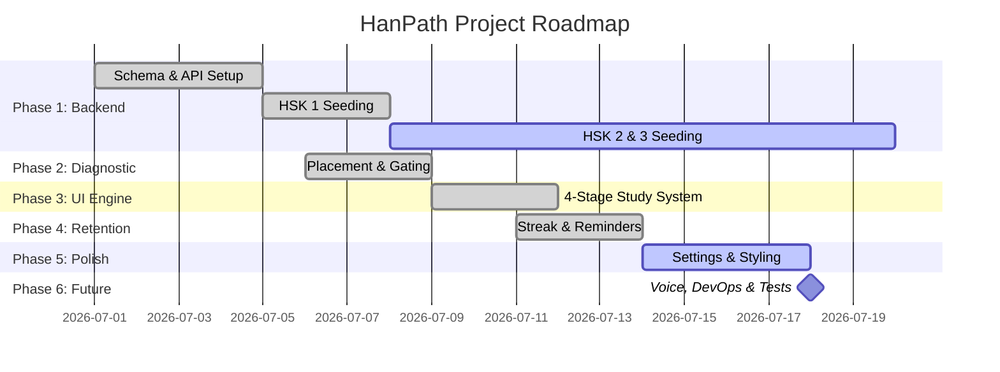

# HanPath Implementation Progress Tracker

This document tracks the tasks and milestones for **HanPath**, a structured daily Chinese learning application.

## Overall Implementation Summary

- **Total Tasks**: 19 (excluding Maintenance & Bug Fixes)
- **Completed Tasks**: 14
- **In-Progress Tasks**: 2
- **Not Started Tasks**: 3
- **Overall Project Completion**: **~80%** (Core Web App: **~95%**)

---

## Detailed Task Board

| Task / Feature Description | Phase | Checklist Status | Progress (%) | Notes |
| :--- | :--- | :---: | :---: | :--- |
| **SQLite Database Schema & Setup** | Phase 1: Database & Backend | `Complete` | 100% | Configured in `database.js` with schemas for lessons, vocab, grammar, dialogues, and progress tracking. |
| **Express API & Server Routes** | Phase 1: Database & Backend | `Complete` | 100% | Implemented in `server.js` with routes for lessons, full curricula, and user progress backup. |
| **Full HSK 1 Curriculum Seeding** | Phase 1: Database & Backend | `Complete` | 100% | 21 lessons generated and seeded containing all 150 HSK 1 words, grammar, dialogues, and quizzes. |
| **HSK 2 & 3 Curriculum Seeding** | Phase 1: Database & Backend | `In Progress` | 20% | 5 mock/structural lessons seeded for HSK 2 and HSK 3; requires full curriculum data generation. |
| **Level Placement Pre-Test System** | Phase 2: Diagnostic & Assessment | `Complete` | 100% | 12-question diagnostic test that maps results to recommended start levels. |
| **Lesson Pre-test (Gating)** | Phase 2: Diagnostic & Assessment | `Complete` | 100% | 3-question diagnostic pre-test for each lesson with an option to skip if scored 100%. |
| **Stage 1: Vocabulary & Tracing** | Phase 3: Core Learning Engine | `Complete` | 100% | Flashcards with click-to-flip animations and an interactive drawing canvas using `hanzi-writer.min.js`. |
| **Stage 2: Grammar & Practice** | Phase 3: Core Learning Engine | `Complete` | 100% | Grammar explanations, example sentences, and interactive word-reordering exercises. |
| **Stage 3: Dialogue & TTS Playback** | Phase 3: Core Learning Engine | `Complete` | 100% | Bilingual dialogue reader with speaker avatars, translation toggle, and speech synthesis engine. |
| **Stage 4: Lesson Review Quiz** | Phase 3: Core Learning Engine | `Complete` | 100% | 5-question multi-stage quiz with instant answer verification and grammatical explanations. |
| **Pinyin Chart (Lesson 0)** | Phase 3: Core Learning Engine | `Complete` | 100% | Interactive CSS grid with hover popups and 1,600+ human-recorded MP3s mapped dynamically from Purple Culture. Replaces computer 'v' with proper 'ü'. |
| **Streak & Time-Spent Tracking** | Phase 4: Consistency & Retention | `Complete` | 100% | Tracks study streak and total hours; streaks reset dynamically if a day is skipped. |
| **Daily Study Reminder System** | Phase 4: Consistency & Retention | `Complete` | 100% | Periodic interval checks on user-set reminder times and integrated UI status notifications. |
| **User Progress Synchronization** | Phase 4: Consistency & Retention | `Complete` | 100% | Multi-storage model syncing local state (`localStorage`), Express SQLite backend, and IDE `student_progress.json` file. |
| **Settings & Account Management** | Phase 5: Settings & UX Polishing | `Complete` | 100% | Dropdown selectors to change HSK level and database-wide user progress reset button. |
| **Kid-friendly styling & animations** | Phase 5: Settings & UX Polishing | `In Progress` | 95% | Tailored kid-friendly theme with smooth bouncy spring-like physics and transitions; minor fine-tuning. |
| **Pronunciation Assessment** | Phase 6: Future Enhancements | `Not Started` | 0% | Planned integration of speech recognition API to analyze and score user speech input. |
| **Production Deployment & DevOps** | Phase 6: Future Enhancements | `Not Started` | 0% | Docker containerization and setup on cloud platform (e.g. Vercel/Render). |
| **Automated Test Suite** | Phase 6: Future Enhancements | `Not Started` | 0% | Mock backend API testing (Jest/Supertest) and frontend component testing. |
| **Authentication Stability Fix** | Maintenance & Bug Fixes | `Complete` | 100% | Resolved case-sensitivity login failures in `auth.js` and removed syntax errors in `app.js` blocking session loads. |
| **Pre-Test Data Injection** | Maintenance & Bug Fixes | `Complete` | 100% | Restored missing `preTestQuestions` array into `app.js` to unblock user progression to the dashboard. |

---

## Phase-wise Breakdown

### Phase Progress Breakdown

1. **Phase 1: Database & Backend** (SQLite, REST API, Seeding)
   - **Progress**: 80%
   - *Next Action*: Expand curriculum files to fully populate HSK 2 (150 words) and HSK 3 (300 words).
2. **Phase 2: Diagnostic & Assessment** (Placement & Gating)
   - **Progress**: 100%
   - *Next Action*: Complete.
3. **Phase 3: Core Learning Engine** (Vocab, Grammar, Dialogue, Quiz)
   - **Progress**: 100%
   - *Next Action*: Complete.
4. **Phase 4: Consistency & Retention** (Streak, Time, Reminders, Sync)
   - **Progress**: 100%
   - *Next Action*: Complete.
5. **Phase 5: Settings & UX Polishing** (Settings, Reset, Spring Animations)
   - **Progress**: 97.5%
   - *Next Action*: Refine responsive layout behavior on smaller mobile displays.
6. **Phase 6: Future Enhancements** (Voice Assessment, DevOps, Testing)
   - **Progress**: 0%
   - *Next Action*: Plan speech-to-text API integration and outline tests.
