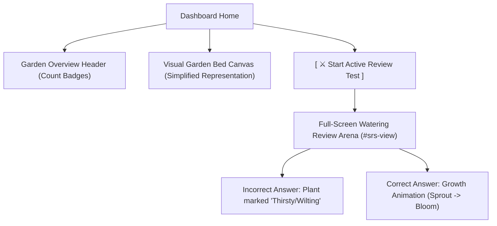

# UX/UI Redesign Proposal: Vocab Garden & Review Arena

This document outlines the proposed design and engineering strategy to address the readability, dashboard clutter, and layout stability issues on the HanPath **Vocab Garden** screen.

---

## 🎨 Design Philosophy & Goals
As a Senior UI/UX Designer and Frontend Engineer, our goals for this redesign are:
1. **Linguistic Readability:** Chinese Hanzi must be immediately legible and high-contrast across all display resolutions and browser themes.
2. **Cognitive Calmness:** Minimize dashboard noise by transitioning from a large, unstructured grid of 300+ cards to a clean, gamified summary dashboard that channels user attention to a single primary action (Active Review).
3. **Layout Stability:** Prevent shifting content and overlapping elements, ensuring the sidebar controls stay docked, visible, and interactive during scroll actions.

---



---

## 🛠️ Detailed Implementation Plan

### 1. FIX 1: Text Contrast & Styling (Linguistic Legibility)
* **Problem:** Hanzi characters are styled with `color: #fff;` on a `.glass-panel` card that is itself 95% opaque white. This renders them invisible or barely visible depending on the background.
* **Solution:** We will update the CSS structure in [`modules/garden.js`](file:///C:/Users/USER/OneDrive/Desktop/knowledge/My%20project/Chinese%20web%20learning/modules/garden.js):
  * Force Hanzi color to `#1e293b` (dark slate blue) for optimal contrast on light card layouts.
  * Increase font-weight to `700` (bold) and use a clean vertical lockup where the Hanzi sits prominently above the Pinyin.
  * Ensure standard font sizing (minimum `1.65rem`) to guarantee readability for students learning strokes.

```diff
-          <!-- Character Display -->
-          <div class="plant-character" style="font-size: 1.5rem; font-weight: bold; margin-bottom: 0.15rem; color: #fff;">
-            ${plant.character}
-          </div>
+          <!-- Character Display (High Contrast #1e293b) -->
+          <div class="plant-character" style="font-size: 1.75rem; font-weight: 800; margin-bottom: 0.25rem; color: #1e293b; font-family: 'Noto Serif SC', serif;">
+            ${plant.character}
+          </div>
```

---

### 2. FIX 2: Replace Static Grid with a "Review Arena" Dashboard
* **Problem:** Displaying hundreds of static cards in a scrolling grid clutters the dashboard, slows down page rendering, and doesn't encourage interactive habit-building.
* **Solution:** 
  * Replace the static grid inside `#main-garden-canvas-slot` with a gamified **"Garden Bed Visual Overview"**. 
  * Show a clean, centralized **Garden Stats Header** featuring colorful stage badges (e.g., `🌱 11 Seeds` | `🌿 4 Sprouts` | `🌻 2 Flowers` | `🌳 1 Golden Trees`).
  * Introduce a large, satisfying, kid-friendly main CTA button: `[ ⚔️ Start Active Review Test ]` that launches the round-robin SRS quiz.
  * Instead of rendering all 300 cards, we will render a **stylized interactive garden patch** (e.g. 5x4 grid of soil plots showing only active growing plants with hover tags, or a clean visual gallery categorized by growth stage) that prevents scroll exhaustion.
  * Integrating active growth animations: correct answers in the Watering Arena (`#srs-view`) trigger a CSS-based bounce & scale-up particle burst (Sprout ➔ Bloom transition) before updating the DB state.

---

### 3. FIX 3: Dashboard Layout & Sidebar Stability
* **Problem:** When scrolling the main screen, the right sidebar (Unlocked Lessons & Learning Labs) scroll out of view, making navigation disjointed and leaving empty void spaces.
* **Solution:**
  * Add a sticky layout wrapper to the right column in [`style.css`](file:///C:/Users/USER/OneDrive/Desktop/knowledge/My%20project/Chinese%20web%20learning/style.css).
  * Lock the sidebar using `position: sticky; top: 110px; max-height: calc(100vh - 130px); overflow-y: auto;` so it remains fully functional and anchored as the user interacts with the dashboard.
  * Adjust flex/grid layouts to utilize responsive breakpoints so it scales cleanly on iPads and mobile layouts.

```css
/* Sidebar Sticky Lock */
@media (min-width: 1024px) {
  .dashboard-sidebar {
    position: sticky;
    top: 110px;
    max-height: calc(100vh - 140px);
    overflow-y: auto;
    padding-right: 4px;
  }
}
```

---

## 📋 Action Plan & Affected Files
1. **Modify Layout:** Update [`index.html`](file:///C:/Users/USER/OneDrive/Desktop/knowledge/My%20project/Chinese%20web%20learning/index.html) to structure the dashboard grid with class names (`.dashboard-sidebar` and `.dashboard-content`).
2. **Apply Styles:** Edit [`style.css`](file:///C:/Users/USER/OneDrive/Desktop/knowledge/My%20project/Chinese%20web%20learning/style.css) to add high-contrast card themes, sticky sidebar classes, and responsive grids.
3. **Refactor Canvas Renderer:** Rewrite `render()` inside [`modules/garden.js`](file:///C:/Users/USER/OneDrive/Desktop/knowledge/My%20project/Chinese%20web%20learning/modules/garden.js) to display the new summary layout and interactive garden bed instead of the giant scrolling card deck.
4. **Wire Controls:** Connect the new CTA buttons in [`app.js`](file:///C:/Users/USER/OneDrive/Desktop/knowledge/My%20project/Chinese%20web%20learning/app.js) to invoke the interactive Review Arena.
