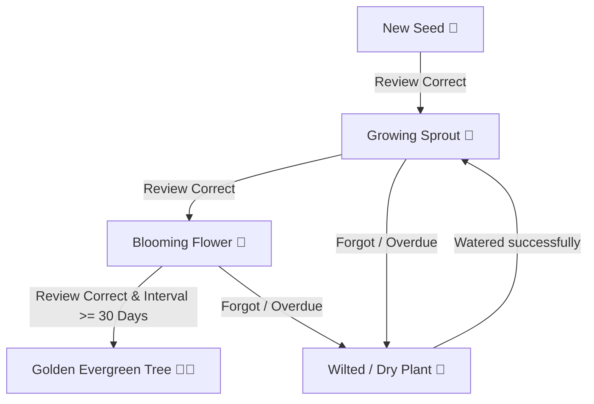

# 🪴 Vocab Garden Upgrade Plan: Active Cognitive Learning Game

This document outlines the architectural plan and EdTech UX specification to upgrade the **Vocab Garden** from a passive, self-graded card review list into an active cognitive learning game.

---

## 🎮 Game Mechanics Design

### 1. Action-Gated Watering System (Active Retrieval)
Instead of self-assessing memory strength using "Needs Practice" or "Got It" buttons, interacting with a thirsty plant triggers a **micro-challenge**. The system evaluates performance automatically and calculates the spaced repetition update based on correctness.

#### Micro-Challenge Types:
1. **Tone Identification (Aural/Visual):**
   * Displays the Hanzi (e.g., `喜欢`) and asks the user to select the correct tone contour for the target syllable (e.g., "What is the tone of 欢?").
   * Interactive buttons: `Tone 1 ¯` (flat), `Tone 2 ˊ` (rising), `Tone 3 ˇ` (dipping), `Tone 4 ˋ` (falling).
2. **Pinyin Input (Active Recall):**
   * Displays the Hanzi and asks the user to type the Pinyin (without tone marks, e.g., typing `xihuan`).
   * A mini IME candidates box appears (like in the Lesson 0 typing game) to select the correct Hanzi, confirming keyboard recall.
3. **Radical / Component Matching (Structural):**
   * Asks the user to identify the semantic component of a character.
   * Example: *"What is the radical of '他' (he)?"* 
   * Options: `亻` (person - Correct), `女` (woman), `口` (mouth), `氵` (water).

#### Gamified Rewards:
* **Perfect (1st try, no hints):** +20 XP. Plant grows significantly, water level goes to 100%. (Updates SRS interval by `Interval * Ease * 1.3`).
* **Got It (2nd try or hint used):** +10 XP. Plant grows slightly. (Updates SRS interval by `Interval * 1.5`).
* **Needs Practice (3rd try or wrong):** +5 XP. Plant wilts slightly. (Resets SRS interval to 1).

---

### 2. Forgetting Curve & Visual Decay (SRS Integration)
We will map the database state of the `user_vocab_srs` table directly to real-time visual states on the screen.



* **Fresh / Blooming:** Recently reviewed and mastered. The plant is green, sways gently, and sparkles.
* **Wilting / Dry:** The current date has passed the calculated `next_review_date`. The plant turns brown/drooping, and a dry water droplet icon (💧) appears.
* **Golden Evergreen Status:** When a word reaches **Mastery Stage 4** AND its `interval_days` is $\ge 30$, it gains "Golden Status." It changes into a golden, glittering plant that does not wilt, representing long-term memory retention.

---

### 3. "Seed Fusion" Lab (Character Construction Logic)
To teach how Chinese words are constructed from individual characters, users can merge "single-character seeds" into compound vocabulary plants.

* **UX Flow:**
  1. Open the **Seed Fusion Lab** panel.
  2. Drag two single-character plants you have sprouted (e.g., `水` - water and `果` - fruit) into the Fusion Chamber slots:
     $$\text{[ 水 (shuǐ) ]} + \text{[ 果 (guǒ) ]}$$
  3. Click **Fuse!**
  4. An animation triggers: the seeds merge with particles, unlocking the compound word plant **水果 (shuǐguǒ - fruit)**.
  5. A popup card explains the etymological connection:
     > *"Water (水) + Fruit/Result (果) = Watery Fruit, which means **Fruit**!"*
  6. The new compound plant is added to your garden.

---

### 4. "Harvest to Sentence" Quest (Contextual Grammar)
To bridge the gap between individual vocabulary words and reading comprehension, fully grown plants can be harvested for a sentence-building quest.

* **Mechanics:**
  1. Once a plant reaches **Mastery Stage 4 (Full Bloom)**, it glows and displays a $\star$ icon.
  2. Clicking it **harvests** the plant and places it in the **Vocabulary Basket**.
  3. Once the basket contains $\ge 3$ words, the **Sentence Quest** button activates.
  4. The game displays a blank-fill sentence (drawn from the HSK curriculum examples).
  5. The user must drag and drop the harvested words from their basket into the correct grammatical spots in the Chinese sentence.
  6. Completing the sentence clears the basket and awards a major XP bonus (+100 XP) and a "Sentence Master" badge.

---

## 🛠️ Technical Implementation Specification

### 1. Database Schema Extensions (`user_vocab_srs`)
No major schema changes are required for basic operations, but we will add a few flags to support harvesting and fusion:
* `harvested`: Integer (`0` or `1`) - Indicates if the word has been harvested and is in the basket.
* `fusion_parent_a`: Integer (Optional) - `vocab_id` of the first component.
* `fusion_parent_b`: Integer (Optional) - `vocab_id` of the second component.

### 2. API Endpoints (in `server.js`)
* `POST /api/srs/water`: Modified to receive `{ vocabId, attemptsCount, hintsUsed }` calculated by the frontend micro-challenge instead of direct user self-grading.
* `POST /api/srs/fuse`: Receives `{ seedA_id, seedB_id }`. Validates if they form a valid HSK compound word in the `vocab` table. If yes, inserts the compound word into `user_vocab_srs` and returns the success details.
* `POST /api/srs/harvest`: Receives `{ vocabId }`. Marks `harvested = 1` in `user_vocab_srs`.
* `POST /api/srs/sentence-quest`: Receives `{ sentenceId, wordOrder }` to validate the drag-and-drop sentence results.

### 3. Frontend Architecture (`app.js`)
* **State Management additions:**
  ```javascript
  state.garden = {
    selectedPlant: null,
    activeChallenge: null,
    fusionBasket: [], // [seedA, seedB]
    harvestBasket: [] // harvested words ready for sentence quest
  };
  ```
* **UI Components:**
  * `#srs-arena-container` will render the dynamic micro-challenge UI with an interactive timer, input field, and option selectors.
  * A new `#garden-fusion-tab` inside the Vocab Garden view.
  * A new `#sentence-quest-overlay` for the drag-and-drop gameplay.

---

## 🎨 Visual Aesthetics & Micro-interactions
* **Visual Theme:** Soft glassmorphic containers (`backdrop-filter: blur(10px)`) with glowing pastel gradients.
* **Growth Animations:** Plants use spring-like scale transitions (`transform: scale(0) -> scale(1.1) -> scale(1)`) on growth upgrades.
* **Particles:** HTML5 Canvas particle explosion on successful "Seed Fusion" merges.
* **Sound Effects:** Triggers lightweight audio cues for watering (soft water splash) and successful harvesting (gentle chime).

---

## 📅 Phased Implementation Plan

1. **Phase 1: Active Watering Arena**
   * Write challenge generator logic in JS (extracts radicals, syllables, and pinyin).
   * Design tone-picker buttons and text input screens in the `#srs-view` template.
   * Connect challenge outputs directly to `POST /api/srs/water`.

2. **Phase 2: Visual Decay & Gold Trees**
   * Write a calculation script comparing `next_review_date` to current Bangkok time.
   * Add CSS animations for drooping (wilting) and glowing particle frames (gold status).
   * Update the widget renderer to filter and color plants based on decay/gold status.

3. **Phase 3: Seed Fusion Lab**
   * Add the Fusion panel to the garden widget.
   * Create the backend route `/api/srs/fuse` that checks compound validity.
   * Implement CSS transition animations for combining elements.

4. **Phase 4: Sentence Quest**
   * Implement drag-and-drop DOM element tracking.
   * Add harvest toggles and visual indicators to stage 4 plants.
   * Connect sentences to backend validators.
